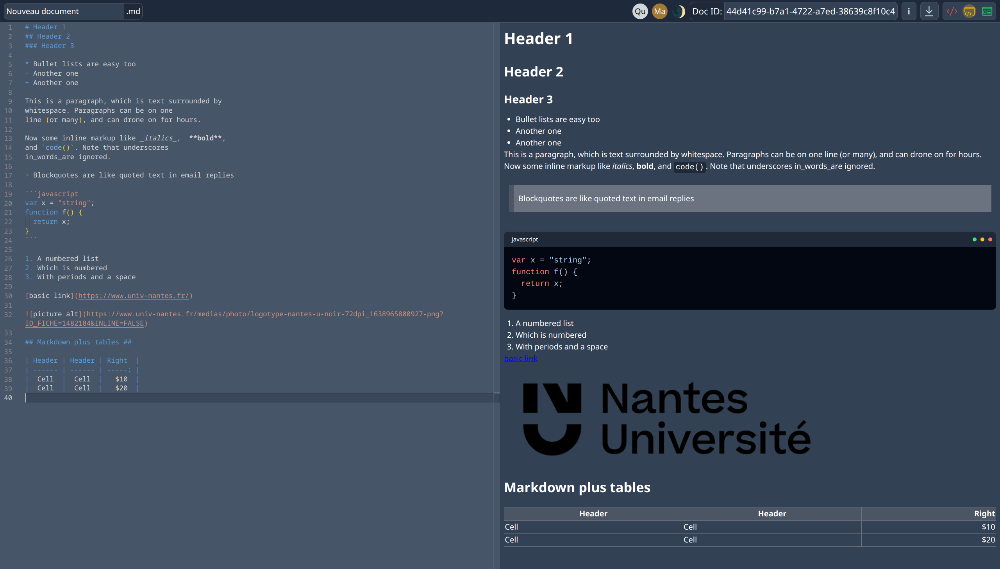
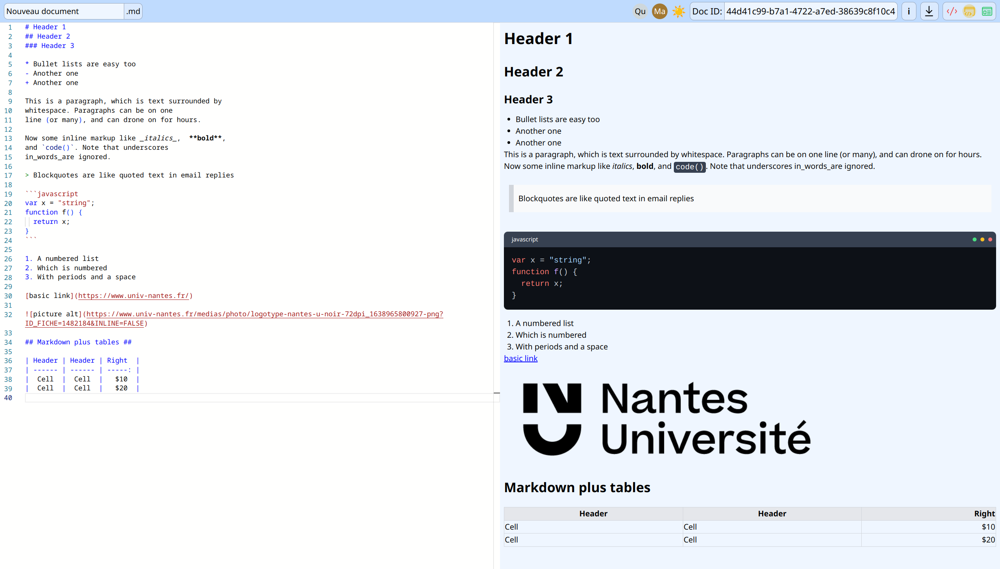

# Markdown Editor

## M2S1 - Middleware Project - Client

Ce projet fait partie du cours Middleware de la deuxième année du Master ALMA de l'Université de Nantes.

### Membres du groupe
- [Matthéo Lécrivain](https://github.com/MattheoLec)
- [Nathan Deshayes](https://github.com/nathan-art)
- [Quentin Gomes Dos Reis](https://github.com/QGdev)
- [Rodrigue Meunier](https://github.com/Rod4401)

## Description du projet

Le but du projet est de construire une application, nous avons choisi de faire un éditeur collaboratif Markdown.
Ce projet est réparti dans deux dépôts github, celui-ci contient la partie client du projet, et un autre dépôt contient la partie serveur, avec des explications plus détaillées (voir [M2S1-MiddlewareProject-Server](https://github.com/QGdev/M2S1-MiddlewareProject-Server)).
La partie serveur contient également les instructions pour compiler et exécuter le projet, nous allons donc juste expliquer le fonctionnement global de l'application et les fonctionnalités de la partie client.

## Choix techniques

L'application est développée avec [Svelte](https://svelte.dev/), un framework javascript qui permet de créer des applications web. Nous utilisons également [TypeScript](https://www.typescriptlang.org/) pour le typage des variables, et [TailwindCSS](https://tailwindcss.com/) pour faciliter le style des composants.
Nous avons utilisé [SvelteKit](https://kit.svelte.dev/) pour la création du projet, qui crée un projet Svelte avec un serveur NodeJS, et qui permet de créer des routes et des endpoints facilement.

## Fonctionnement général

Pour la partie client, le contenu du document est simplement représenté par une chaîne de caractères nommée `code`, qui contient le code Markdown.

### API REST

Lors du démarrage de l'application, une fenêtre de dialogue permet à l'utilisateur de créer ou de rejoindre un document.
En fonction de son choix, l'application fait appel aux fonctions `createDocument` ou `joinDocument`.
Les informations du document sont ensuite stockées dans la variable `documentAnswer`, puis le contenu et le nom du document sont actualisés sur la page.
Une documentation plus détaillée de l'API REST est disponible dans le dépôt de la partie serveur.

### Websocket

Au lancement de l'application, une connexion websocket est établie avec le serveur avec :

```javascript
socket = new WebSocket(`ws://${apiUrl}/ws`);
```

Nous utilisons ensuite la connexion websocket bidirectionnelle de la façon suivante :

#### Envoi de messages

Pour chaque modification du document par l'utilisateur, la fonction `onCodeUpdate` est appelée.
Son rôle est de déterminer l'action effectuée par l'utilisateur, en fonction de la position du curseur de l'utilisateur, et de l'état actuel et précédent du code.
La fonction envoie ensuite le message correspondant au serveur avec la fonction `sendMessage`.

Les modifications du nom du document sont envoyées à chaque fois que l'utilisateur sort du champ de saisie du nom du document, avec la fonction `onDocNameInputBlur`.

#### Réception de messages

Le client écoute les messages du serveur avec le listener défini au lancement de l'application :

```javascript
socket.addEventListener('message', (event) => {
    // Actions à effectuer en fonction du type de message
});
```

Le client actualise donc la liste des utilisateurs connectés quand il reçoit des messages 'CONNECT' ou 'DISCONNECT'.\
Les messages 'INSERT_CHAR', 'DELETE_CHAR', 'INSERT_LINE_BRK' et 'DELETE_LINE_BRK' actualisent la variable `code` du client, en fonction de l'emplacement de la modification indiquée dans le message.
Ces derniers ne sont traités que si l'id d'utilisateur qui émet le message est différent de l'id du client qui reçoit le message.
Ainsi, les modifications du document effectuées par l'utilisateur ne sont pas répercutées sur son propre document.

## Fonctionnalités

Voici un aperçu de l'apparence de l'application :

|  |  |
|:-----------------------------:|:------------------------------:|
|          Mode sombre          |           Mode clair           |

Parmi les fonctionnalités de l'application, nous avons implémenté :

- La conversion du code Markdown en HTML pour la prévisualisation.
- La coloration syntaxique du code Markdown généré.
- Thème d'application sombre et clair, adapté au thème du système de l'utilisateur.
- L'affichage de la liste des utilisateurs connectés.
- L'affichage des informations du document (nombre de caractères et nombre de mots).
- L'affichage de l'ID du document, pour le partager avec d'autres utilisateurs.
- La possibilité de télécharger le document au format Markdown.
- La possibilité de changer de vue entre :
  - L'éditeur Markdown
  - La prévisualisation du document
  - Les deux vues côte à côte

### Librairies utilisées

Nous avons utilisé plusieurs librairies, afin de ne pas passer trop de temps sur des fonctionnalités qui ne sont pas le but du projet.
Parmi ces librairies, nous avons utilisé :

- [Marked](https://github.com/markedjs/marked): Parseur Markdown vers HTML.
- [Highlight.js](https://github.com/highlightjs/highlight.js): Coloration syntaxique du code Markdown.
- [marked-highlight](https://github.com/markedjs/marked-highlight): Intégration de Highlight.js dans Marked.
- [isomorphic-dompurify](https://github.com/kkomelin/isomorphic-dompurify): Purification du HTML généré par Marked.
- [svelte-toast](https://github.com/zerodevx/svelte-toast): Affichage de notifications en bas de page.
- [monaco-editor](https://github.com/microsoft/monaco-editor): Champ d'édition du code Markdown.

> **Note:** Nous avons d'abord développé notre propre champ d'édition du code Markdown, mais nous avons rencontré des problèmes lorsque plusieurs utilisateurs modifiaient le document en même temps.
> Nous avons donc décidé d'utiliser Monaco Editor, un champ d'édition déjà existant, qui est plus performant et qui gère mieux les modifications concurrentes.
>
> L'intégration de Monaco Editor dans Svelte n'étant pas très bien documentée, nous avons utilisé [ce tutoriel](https://www.codelantis.com/blog/sveltekit-monaco-editor) pour l'intégrer dans notre projet.
